<!-- ✦･ﾟ LUNA · COSMIC CAT-WITCH README ･ﾟ✦ -->

<!-- ✦ ANIMATED LUNA HERO (shining moon, drifting clouds, blinking cat, sparkles) ✦ -->

  

<!-- ✦ MOVING TYPING TEXT ✦ -->

## 🌙 The Cat-Witch Behind the Wand

> *"Every bug is just a spell I refused to give up on."*

🐈‍⬛ Cosmic cat-witch casting full-time in **Iceland** ❄️
💻 Computer Engineer specializing in **Information Systems**, brewing potions of **data analysis, machine learning & AI-driven knowledge extraction**
🌸 Studying my **Master's in Cybersecurity & Engineering** at the academy
🔬 On a quest to bridge **medicine + AI** for better patient outcomes
🌍 Casting alongside **Clinic Barcelona** & medical experts for real-world magic
✨ Always looking for a dynamic coven to grow with and lift up

`Building spells with:` **Java** · **C++/C** · **React** · **Node.js** · **Python**

 

## 📖 My Spellbook, Tech I Wield

**🧪 Potions of Data & Machine Learning**

**✨ Charms of the Frontend**

**🔧 Enchantments of the Backend**

**🗄️ Vaults & Databases**

**🌩️ Rituals of DevOps & Infrastructure**

**🌍 Ancient Open-Source Artifacts**

## ✨ Moonlight Stats

 

 

## 🧹 The Grimoire, Featured Spells

> *A cat-witch is only as good as the spells she dares to cast.*

### 🧪 [Objective Quantification of Pruritus in PBC](https://github.com/soukainacodes/Objective-Quantification-of-Pruritus-in-PBC)
`✦ level: enchanted` : A data-driven ritual to quantify pruritus in PBC patients for sharper clinical decisions.

### 💱 [Predicting Exchange Rates Using SVM](https://github.com/soukainacodes/Using--SVM-To-Predict-Swedish-Krona)
`✦ level: divination` : Foretelling exchange rates, Linear vs Huber Regression on ECB data, scried through MSE & Huber Loss.

### 🚗 [From Multivariant Data Analysis to Predictive Modeling on UK's Used Car Prices](https://github.com/soukainacodes/UK-Cars-Used-MVA-ML)
`✦ level: grand ritual` : Data cleaning, EDA, MVA, clustering & ML woven into one spell of actionable insight.

### 🎭 [Building & Migrating the Contemporary Catalan Drama Database (DCC)](https://dcc.institutdelteatre.cat/)
`✦ level: archmage` : A vast repository conjured on DSpace 7.6, with massive data migration and UI/UX enchantments.

### 🎲 [AI-Powered Scrabble Game](https://github.com/soukainacodes/scrabble-project-in-java)
`✦ level: familiar summoning` : A full Scrabble game in Java with player-vs-machine logic, dictionaries, rankings & an AI player built on resolution algorithms.

### 🛡️ [Turfs, Free Ad Blocker Chrome Extension](https://github.com/soukainacodes/turfs)
`✦ level: protective ward` : A lightweight open-source shield against ads. Simple ON/OFF toggle, privacy-first, customizable rules via Chrome's Declarative Net Request API.

## 💫 Send a Message Across the Night Sky

📫 **Reach me:** [soukainamm98@gmail.com](mailto:soukainamm98@gmail.com)
🌐 **Spellbook:** [soukainamehboub.com](https://soukainamehboub.com)
🌙 *Always happy to chat magic, code & everything between!*

 

<!-- ✦ CONTRIBUTION SNAKE (auto-regenerated by .github/workflows/snake.yml) ✦ -->

  

✦ made with moonlight, sparkles & a little witchcraft ✦

